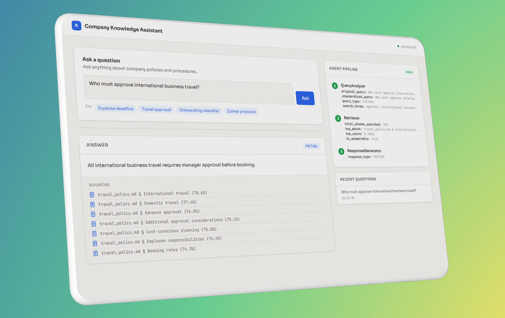

# Company Knowledge Assistant

A RAG multi-agent system that answers questions about internal company documents.

---

## Problems and how they were solved

The document set contains a few files that aren't straightforward to handle. Part of the challenge was figuring out what makes them tricky and designing the system to deal with each case correctly.

### Documents with meaningless content

`krzth_monkey_document.md` contains only made-up words, and `symbolic_reference.md` contains only symbols. When a user asks "Summarize the Krzth Monolithic Reference document", the similarity search could not find that document because embedding nonsense text produces vectors with no semantic meaning. Instead, it was returning chunks from `zulmar_policy.md`, which shares a similar nonsense vocabulary.

The fix was straightforward. During chunking, the `section_title` is added as a prefix to the content of each chunk. The title "Krzth Monolithic Reference" is the only meaningful text in that document, and it is enough for similarity search to find the right file. The ResponseGenerator then recognizes that the content is not interpretable and returns a user-friendly message.

### Zulmar policy and Quantum Synergy policy

`zulmar_policy.md` uses made-up terminology and `quantum_synergy_policy.md` uses corporate buzzword language, but both have a valid document structure. The system answers based on what the documents say and cites them as sources. Whether the content is meaningful in the real world is outside the scope of a RAG system. Its only job is to be a faithful intermediary between the user and the documents.

### Duplicate documents

`hr_onboarding.md` and `onboarding_process.md` are identical, as are `kickoff.md` and `project_kickoff.md`. All files go through ingestion and nothing is filtered manually.

ChromaDB deduplicates identical chunks during ingestion using content hashing. This matters for retrieval quality. Without deduplication, the same content appearing in multiple files would receive artificially higher weight in similarity search simply because of repetition, which would skew results toward those topics for no real reason.

### WIP document

`expense_policy_wip.md` is an incomplete version of the `expense_policy.md` marked with "Not finished, do not use". All documents go through ingestion without manual filtering, the system decides how to handle them.

During ingestion, the document registry scans each file for warning signals and saves the result to `registry.json`. In this case the WIP shares identical content with the final version, so ChromaDB deduplicates those chunks by content hash and only the unique "do not use" chunk enters the database. This is a coincidence of alphabetical processing order, not a guaranteed behavior for all flagged documents.

The key constraint is that flagged chunks never reach the LLM. The retriever excludes them from the answer generation context. If triggered, they appear in a separate "found but not used" section with a warning so the user knows the document exists and is flagged.

---

## Architecture

Three agents in a single process, running as a sequential pipeline coordinated by the Orchestrator. A single process was chosen instead of microservices because it is sufficient for this scope. The boundaries between agents are clean and the system can be split into separate services if needed.

```
User Query
    ↓
[1] QueryAnalyzer      — normalizes the question, classifies type, extracts search terms
    ↓
[2] Retriever          — vector search in ChromaDB, threshold check, source filtering
    ↓
[3] ResponseGenerator  — generates answer based on query type, cites sources
    ↓
Answer + Sources + Step log
```

### QueryAnalyzer
- Normalizes the question, typos, informal language and abbreviations are cleaned up before embedding
- Classifies query type as `FACTUAL`, `PROCEDURAL`, or `SUMMARIZATION`
- Extracts key search terms
- Embeds the normalized question, not the original

### Retriever
- Embeds the query using the same model as ingestion (`gemini-embedding-001`), keeping the vector space consistent
- Vector search in ChromaDB, top K = 7
- Drops chunks below the similarity threshold of 0.70
- Only shows sources within 10% of the top score
- Flagged chunks are excluded from the LLM context and shown separately as "found but not used"

### ResponseGenerator
- `FACTUAL` → direct, concise answer
- `PROCEDURAL` → checklist with checkboxes
- `SUMMARIZATION` → structured summary
- If `is_answerable = False` → "Information not available"
- Always cites sources with similarity percentage

---

## UI Dashboard

A web interface for interacting with the system. It shows the agent pipeline in real time, sources with similarity scores, warnings for flagged documents, and a history of recent questions. It communicates with the FastAPI server on port 8000.



---

## Stack

| Component | Technology |
|---|---|
| Embeddings | `gemini-embedding-001` |
| LLM | `gemini-2.5-flash` |
| Vector store | ChromaDB (local) |
| Backend | FastAPI |
| UI | Vanilla HTML/CSS/JS |

The same embedding model is used during both ingestion and querying. Using different models would create inconsistent vector spaces and break similarity search.

---

## Chunking strategy

Structure-based chunking by MD headings (`#`, `##`, `###`) with a 3-line overlap between sections. Each chunk includes the `section_title` as a prefix in the content:

```
"Submission Deadline\n\nExpense claims must be submitted within 15 calendar days..."
```

This is critical for documents with uninterpretable content where the title is the only meaningful information available.

---

## Running the project

### Prerequisites
```bash
python -m venv venv
venv\Scripts\activate        # Windows
pip install -r requirements.txt
```

Create a `.env` file:
```
GEMINI_API_KEY=your_key_here
```

### Ingestion (run once)
```bash
python ingest.py
```

### CLI
```bash
python main.py
```

### API + Dashboard
```bash
# Terminal 1
uvicorn api.server:app --reload --port 8000

# Terminal 2 — open in browser
ui/dashboard.html
```

---

## Project structure

```
rag_agent/
├── agents/
│   ├── base.py
│   ├── query_analyzer.py
│   ├── retriever.py
│   └── response_generator.py
├── core/
│   ├── context.py
│   └── orchestrator.py
├── config/
│   ├── retrieval.yaml
│   └── prompts/
├── ingestion/
│   ├── loader.py
│   ├── chunker.py
│   ├── embedder.py
│   └── document_registry.py
├── api/
│   └── server.py
├── ui/
│   └── dashboard.html
├── evaluation/
│   └── run_eval.py
├── documents/
├── ingest.py
└── main.py
```

---

## Configuration

`config/retrieval.yaml` contains all key values that can be changed without touching the code:

```yaml
similarity_threshold: 0.7
top_k: 7
source_margin: 0.1
support_email: support@company.com
```

Prompts live in `config/prompts/` and can be edited without restarting the server.
